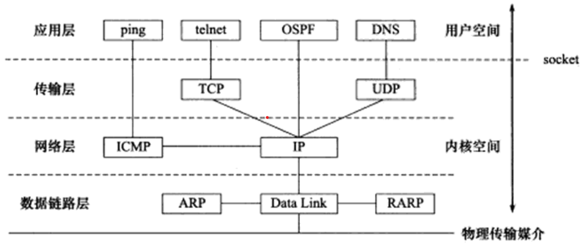
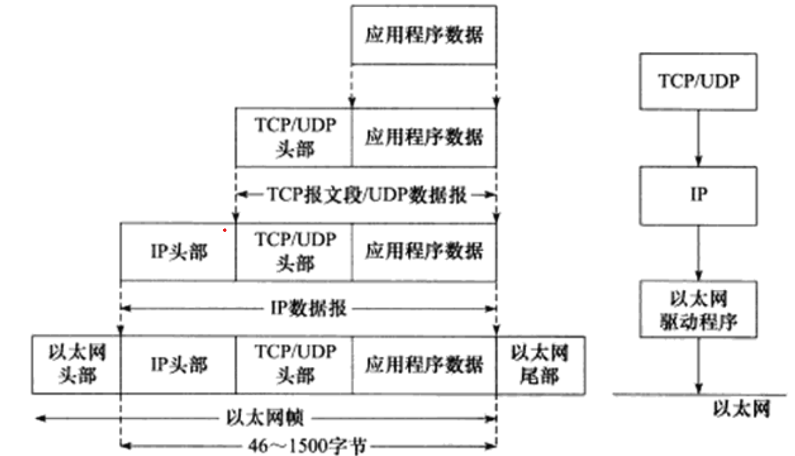
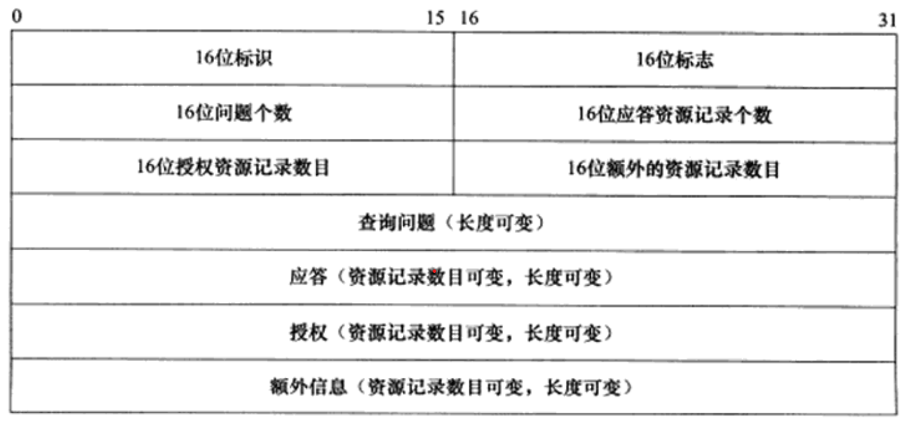

## 第一章 TCP/IP协议族

### TCP/IP 协议族体系结构及主要协议

#### 数据链路层

- 实现网卡接口的网络驱动程序，以处理数据在物理媒介(如以太网，令牌环等)上的传输。
- 隐藏底层的细节，向上层提供统一的接口。
- 常用协议有ARP(Address Resolve Protocol，地址解析协议)和RARP(Reverse Address Resolve Protocol，逆地址解析协议)。用于实现IP地址和机器物理地址(通常为MAC地址)之前的相互转换。

#### 网络层

- 实现数据包的选路和转发。
- 隐藏网络拓扑连接的细节，让上层看来通信的双发是直接相连的。
- 最核心的协议是IP(Internet Protocol，因特网协议)。根据IP地址来决定如何发送数据包。
- ICMP协议(Internet Control Message Protocol, 因特网控制报文协议)。是IP协议的补充，主要用于检测网络连接。

#### 传输层

- 为两台主机上的引用程序提供端到端的通信。
- 为应用程序封装了一条端到端的逻辑通信链路，负责数据的收发，超时重传等。
- 主要协议有：
  - TCP(Transmission Control Protocol，传输控制协议)，可以为应用层提供可靠的，面向连接的和基于流的服务。
  - UDP(User Datagram Protocol，用户数据包协议), 为应用层提供的是不可靠，无连接和基于数据包的服务。
  - SCTP(Stream Control Transmission Protocol，流传输控制协议)

#### 应用层

- 负责处理程序的逻辑。
- 主要的程序和协议有：
  - ping，应用程序。利用ICMP报文检测网络连接(具体是利用ICMP的回送请求报文和回送响应报文)，来判断两个主机之间是否可达。
  - telnet，远程登陆协议。让用户能在本地完成远程任务。
  - OSPF(Open Shortest Path First, 开放最短路径优先)协议，用于路由器之间通信进行路由更新。
  - DNS(Domain Name Service, 域名服务)，提供域名到IP地址的转换。

### 封装

- 上层协议使用下层协议的服务是通过封装实现。每层协议都将在上层数据的基础上加上自己的头部信息(有时还有尾部信息)。

#### 封装过程

- 发送端应用程序->传输层：
  - 根据使用TCP或者UDP协议，应用层调用对应send(或write)函数写入数据，内核中的TCP或UDP模块将数据复制到发送缓冲区中，加上头部信息后组成为TCP报文段或UDP数据报。
- 传输层->网络层
  - 根据IP协议，将传输层的数据加上IP头部信息后再封装为IP数据报。
- 网络层->数据链路层
  - 数据链路层再封装后为帧。不同的传输媒介也有不同的帧，如以太网帧，令牌环帧。
  - IP数据报加上数据链路层的头部数据后封装为帧。注意：帧有MTU(Max Transmit Unit,最大传输单元)，即帧最多能携带多少上层协议数据。因此，过长的IP数据报可能会被分片。

### 分用

- 接收端将受到的数据根据头部信息交给对应的目标应用程序的过程就叫做分用。

### ARP协议原理

- 能实现`任意网络层地址`到`任意物理地址`的转换。一般讨论IP地址和MAC地址之间的转换。
- 原理为主机将所在网络广播一个ARP请求报文，该请求包含了目标机器的网络地址。此网络中的其他机器都会收到这个请求，但只有目标机器会回复一个ARP应答，请中包含自己的物理地址。

#### 报文格式

| 硬件类型 | 协议类型 | 硬件地址长度 | 协议地址长度 | 操作  | 发送端以太网地址 | 发送端IP地址 | 目的端以太网地址 | 目的端IP地址 |
| -------- | -------- | ------------ | ------------ | ----- | ---------------- | ------------ | ---------------- | ------------ |
| 2字节    | 2字节    | 1字节        | 1字节        | 2字节 | 6字节            | 4字节        | 6字节            | 4字节        |

- `硬件类型`表示物理地址的类型，为1表示MAC地址。
- `协议类型`表示要映射的协议地址类型，为0x800表示IP地址。
- `地址长度`单位为字节，MAC为5，IP为4.
- `操作`：1表示ARP请求，2表示ARP应答，3表示RARP请求，4表示RARP应答。
- ARP请求会填充发送端以太网地址，发送端IP地址，目的端IP地址并广播；接收端发现该目的端IP地址和自己相同就会把自己的以太网地址填进去，交换目标地址和发送地址并将操作改为2等构造为ARP应答报文发送出去。

#### ARP高速缓存

- 每个主机都会维护一个ARP的缓冲，包含经常访问的机器IP地址和物理地址之间的映射。
- 避免重复的ARP请求，主机发送数据前会先查ARP表看是否包含目的主机，如果没有才会发送ARP请求；同理，收到应答后会将映射写入ARP表中。

### DNS工作原理

- DNS是一套分布式的域名服务系统。每个DNS服务器上都存放着大量的`机器名`和`IP地址`的映射，并且动态更新。

#### 报文格式

- `标识`用于标记一对DNS查询和DNS应答，用于区分一个DNS应答是那个DNS查询的回应。
- `标志`用于协商具体的通信方式和反馈通信状态。如查询，应答标志，递归查询标志等。

### SOCKET

- 数据链路层，网络层，传输层协议是在内核中实现的。因此操作系统需要提供一组系统调用，使得应用程序能够访问这些协议提供的服务。这组系统调用的API主要有两套：socket和XTI，XTI基本已经弃用。
- 提供的功能主要有两点：
  - 将应用程序数据从`用户缓冲区`中复制到TCP/UDP`内核发送缓冲区`，以交付内核来发送数据(如send函数)，或者相反从`内核TCP/UDP接收缓冲区`中复制数据到`用户缓冲区`。
  - 应用程序可以通过它来修改内核中各层协议的某些头部信息或其他数据结构，从而精细的控制底层通信的行为。
