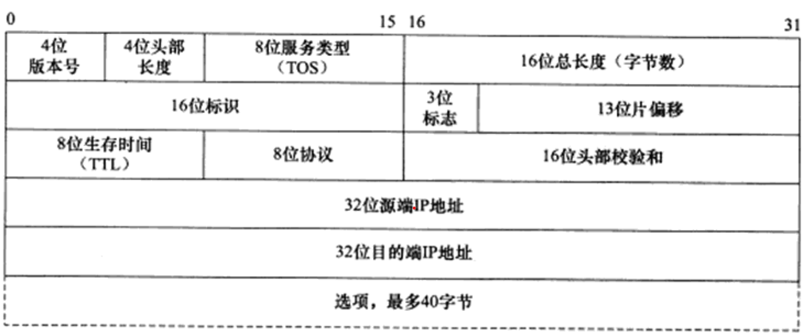

## 第二章 IP协议详解

### IP服务的特点

- 为上层协议提供无状态，无连接，不可靠的服务。
  - 无状态：IP通信双方不同步传输数据的状态信息。优点是简单，高效，缺点是无法处理乱序和重复。
  - 无连接：IP通信双方不长久的维持对方的任何信息。因此每次发送数据都必须指明IP地址。
  - 不可靠：IP协议不能保证数据准确到达接收端，只是尽最大努力交付。

### IPv4头部结构

- 版本号(version)：IPv4为4。
- 头部长度(header length)：标识该IP头部有多少个字节(单位为4字节)，因此IP头部最大为15*4 =60字节。
- 服务类型(Type of Service)：包括3位的优先权字段(现已经忽略)，4位的TOS字段和1位保留字段(必须置0）。4位TOS字段分别表示：最小延时，最大吞吐量，最高可靠性和最小费用，最多有一个置1，应用程序根据需求设置；比如ssh和telnet这样的登陆程序需要最小延时的服务，ftp文件传输需要最大吞吐量的服务。
- 总长度(total lenth)：指整个IP数据包的长度(单位为1字节)，因此最大长度为2^16-1 = 65535字节。
- 标识(identification):唯一的标识主机发送的每一个数据包。初始值随机，每发一个就加1。作用是为了分片后的重组。
- 3位标志:
  - 第一位保留。
  - 第二位(Dont Fragment, DF)表示禁止分片。若置为1表示不允许将该IP数据包分片；但是如果长度超过MTU，那么IP模块将会丢弃该数据包并返回一个ICMP差错报文。
  - 第三位(More Fragment, MF)表示更多分片。除了同一个数据包的最后一个分片，其他分片都要把它置1。

- 分片偏移(fragmentation offset): 分片相对于原始IP数据报(仅指数据部分)开始处的偏移，用于分片的重组。实际偏移值是该值乘以8得到的，因此除了最后一个分片，其他分片的长度都必须是8的整数倍。
- 生存时间(Time To Live): 指数据报达到目的地之前允许经过的路由器跳数。每经过一个路由，该值就会减1；当TTL值为0时，路由器会丢弃改数据包并向源端发送ICMP差错报文。
- 协议(protocol):用于区分上层协议。
- 头部校验和(header checksum):由发送端填充，接收端使用CRC算法进行校验`IP数据包头部`是否损坏。
- 源IP地址和目的端IP地址用来标识数据报的发送端和接收端的IP地址。
- 选项字段：可以包含记录路由，时间戳，松散源路由选择，严格源路由选择等。

### IP分片

- 当IP数据报的长度超过帧的MTU时，就会被分片传输。
- 分片可能在发送端，也可以在中转路由器上，可能会被多次分片。但是只在目标机器上才会重新组装。
- 根据标识，标志，片偏移三个字段决定如何组装。

### IP路由

- IP的一个核心任务是数据包的路由，即决定发送数据报到目标机器的路径。
- IP模块实现数据报路由的核心数据结构是路由表，这个表按照数据报的目的IP地址分类，同一类型的IP数据报会被发往相同的下一跳路由器(或目标机器)。

#### 路由表更新

- 通过BGP(Border Gateway Protocol,边际网关协议),RIP(Routing Information Protocol, 路由信息协议),OSPF(Open Shortest Path First,开放最短路径优先协议)去动态更新路由表。

### 重定向

- ICMP重定向报文也可以用于更新路由表。
- ICMP重定向报文提供两个信息：源端iP地址和应该使用的路由器的IP地址。接收主机就可以根据这两个信息决定是否更新路由表。

### IPv6头部结构

- 解决IPv4地址不够用的问题，并且增加了很多功能。

#### 固定头部结构

- 版本号(version):对于IPv6来说为6。
- 通信类型(traffic class):指示数据流通信类型或优先级，和IPv4中的TOS类似。
- 流标签(flow label):用于对链接的服务质量有特殊要求的通信，如实时音视频传输。
- 净荷长度(payload length):标识IPv6扩展头部和应用程序数据长度之和。
- 下一个包头(next header):标识紧跟IPv6固定头部后的包头类型，如扩展头或某个上层协议头。类似IPv4头部中的协议字段。
- 跳数限制(hop limit):和IPv4中的TTL含义相同
- IPv6用128，也就是16字节来表示IP地址，一般用十六进制字符串来表示。

#### IPv6扩展头部

- 可以包含0或多个扩展头部。比如有逐跳选项头部，目的选项头部等，具体功能不展开。

