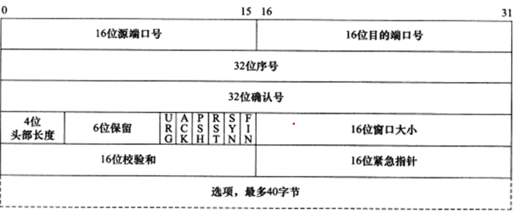
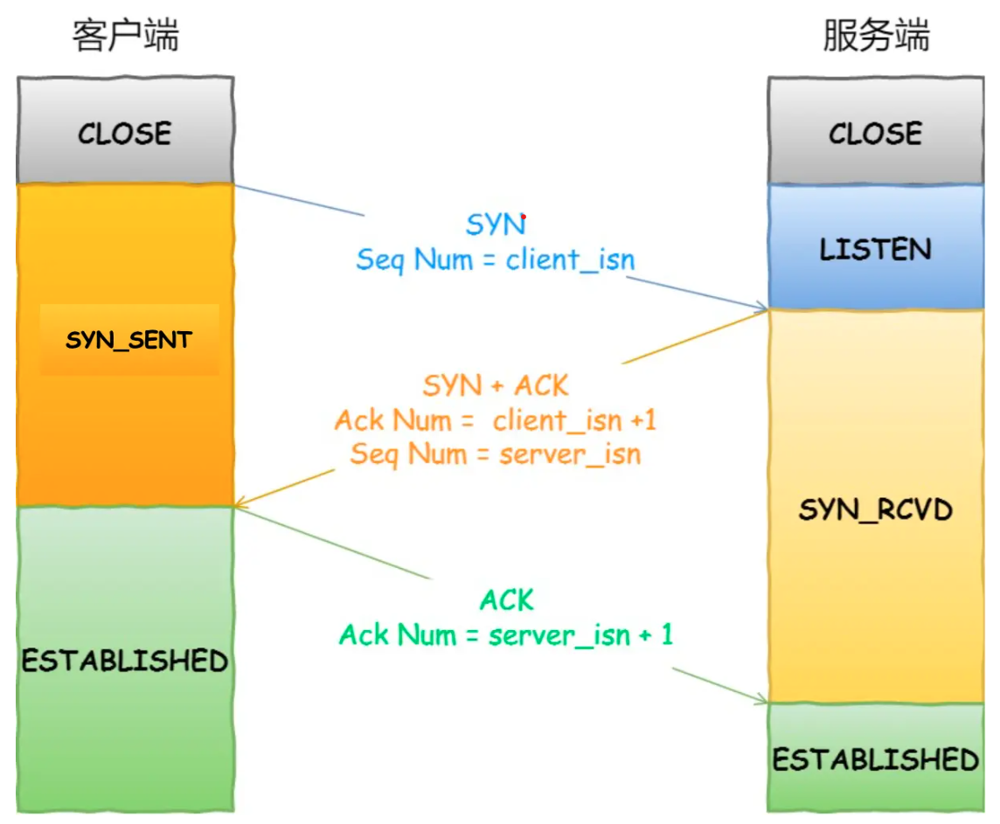
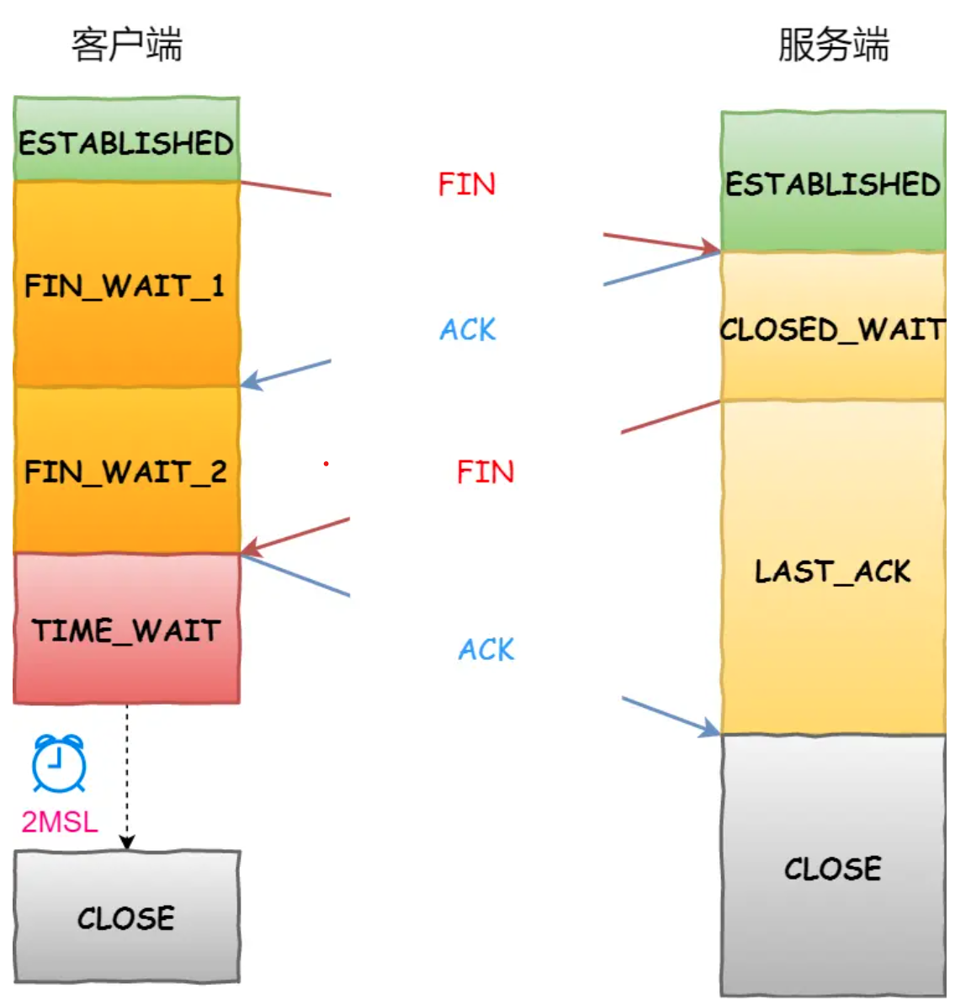

## 第三章 TCP协议详解

### 特点

- 面向连接，字节流和可靠传输。
  - `面向连接`：通信双方必须建立一对一的连接，分配必要的内核资源，以管理连接的状态和连接上数据的传输，才能进行数据的读写。连接是全双工的，所以双方都可以通过一个连接进行数据的读写。结束后双方都需要断开连接并释放系统资源。
  - `字节流`：应用程序对数据的发送和接收是没有边界限制的。发送端执行的写操作次数和接收端执行的读操作次数没有任何关系，数据是被当成字节流的形式发送和接收的。而`UDP`的发送端每执行一次写操作，就会封装一个UDP数据报发送，接收端也必须及时执行一次读操作，否则就会丢包。
  - `可靠传输`：采用发送应答机制，发送端发送的每个TCP报文段都必须得到接收方的应答。 以及超时重传机制，发送端每发出一个TCP报文段后都会启动定时器，如果超时也未受到应答，那么就会重发该报文段。并且，由于IP数据报可能会乱序，重复，所以TCP还会重排整理后再交付给上层。

### 头部结构

#### 固定头部结构

- 端口号(port number):告知该报文段来自哪里，以及该传给哪个上层协议或应用程序。一般来说，服务器通常使用知名服务端口号，客户端使用系统自动选择的临时端口号。
- 序号(sequence number):一次TCP通信中，某个传输方向上的字节流的编号。初始值随机，之后的值根据初始值加上该TCP报文段第一个字节在整个字节流中的偏移来计算。
- 确认号(acknowledgement number):用于对接收的报文段的响应。值为收到的TCP报文段的序号值加1，表明在这个序号之前的所有报文都已经收到。
- 头部长度(header length):标识TCP头部长度(单位为4字节)。
- 标志位:
  - URG：表示紧急指针是否有效。
  - ACK：表示确认号是否有效。携带ACK标志的TCP报文段为确认报文段。
  - PSH：提示接收端应用程序应该立即从TCP缓冲区中取走数据。
  - RST：表示要求对方重新建立连接。携带RST标志的TCP报文段为复位报文段。
  - SYN：表示请求建立一个连接。携带SYN标志的TCP报文段为同步报文段。
  - FIN：表示通知对方本端要关闭连接。携带FIN的TCP报文段为结束报文段。
- 窗口大小(window size):TCP流量控制的手段。窗口指的是接收通告窗口，告诉对方本端的TCP接收缓冲区还能容纳多少字节数据。
- 校验和(TCP checksum):发送端填充，接收端对`TCP报文段`执行CRC算法以校验TCP报文段在传输过程中是否有损坏。
- 紧急指针(urgent pointer):是一个正的偏移量，和序号字段的值相加表示最后一个紧急数据的下一个字节的序号。

### 连接的建立和关闭

#### 连接

- “三次握手”，假设有主机A要想主机B发起TCP连接请求，那么会有如下步骤：
  - 主机B处于`LISTEN`状态。
  - 1：A构造TCP报文段，其中SYN标志位为1，序号为系统随机生成的数x，确认号为0。发送给主机B进行连接请求。此时A处于`SYNSENT`状态。
  - 2：B接收到A发送的报文段1后，状态变为`SYN RCVD`,如果同意通信，就会构造TCP报文段，其中SYN标志位为1，ACK标志位为1，序号为系统随机生成的数y，确认号为x+1。发送给主机A进行答复。
  - 3：A接收到B发送的报文段2后，状态变为`ESTABLISHED`,再次发送TCP报文段，其中ACK标志位为1，序号为x+1,确认号为y+1。注意，在这个报文段中已经可以发送真实的数据。B收到后状态变为`ESTABLISHED`。

- 为什么要三次握手，而不是两次？
  - RFC文档：由于一个报文段的序列号没有和整个网络的时钟绑定并且TCP可能有不同的机制来选择初始的序列号。所以接收方收到一个SYN时，无法确认这是一个新的请求，还是一个过时的请求。所以接收方就需要和发送方确认一下，如果接收方响应这个报文，才能真正的建立连接。
  - 在一个不可靠的信道中，至少需要三次握手，才能够确保通道是畅通的，确保接收方和发送方的接收和发送能力都没有问题。
  - 谢希仁：为了防止已失效的连接请求报文段突然又传送到了服务端，因而产生错误。

#### 关闭

- “四次挥手”，一个已经建立连接的主机A和B要想断开连接，需要有以下步骤：
  - 主机A和主机B都处于`ESTABLISHED`状态。
  - 1. 主机A发送完数据后，想要断开连接，于是构造报文段，其中FIN标志位为1，并发送给主机B。之后主机A进入`FIN_WAIT_1`状态。
  - 2. 主机B接收到报文1后，会向主机A发送ACK应答报文。此时主机B进入`CLOSED_WAIT`状态。
  - 3. 主机A接收到报文2后，会进入`FIN_WAIT_2`状态。
  - 4. 主机B再发送完数据后，构造报文段，其中FIN标志位为1，并发送给主机A。此时主机B进入`LAST_ACK`状态。
  - 5. 主机A收到报文4后，会向主机B发送ACK确认报文段。此时主机A进入`TIME_WATI`状态。
  - 6. 主机B收到报文5后，进入`CLOSE`状态。
  - 7. 主机A在发送报文5后，会等待2MSL时间后进入`CLOSE`状态(在此期间如果又收到了主机B的FIN报文，那么主机A会重发ACK报文并且重置等待时间)。
- 为什么要四次挥手：
  - 每一端的停止发送和确认都需要两次挥手。
- 四次挥手也可以变为三次挥手：也就是第二次的ACK报文和第三次的FIN报文一起发送。 
- 为什么主动结束方最后需要等待2MSL时间？(`MSL`指的是任何报文在网络上存在的最长时间，RFC 1122建议值为2min)
  - `防止历史连接中的数据，被后面相同四元组的连接错误的接收`：存在一种情况是前一次连接的数据报延迟到达了，并且还被错误的当成了本次传输的数据，而等待2MSL就能让所以这次连接中的可能的延迟包都消失。
  - `保证「被动关闭连接」的一方，能被正确的关闭`：等待足够的时间以确保最后的 ACK 能让被动关闭方接收，从而帮助其正常关闭。如果主动关闭方在发送第四个ACK报文后直接进入`CLOSE`状态，被动关闭连接方有可能没有接收到主动关闭方发送的第四个ACK报文，并且重发FIN报文后也没有收到确认，这就可能导致被动关闭方无法正常的关闭。

### 超时重连

- 如果客户端没有收到服务器端发送的确认报文段。那么客户端就会进行重传，一般来说重传的间隔是2的n次方，单位为S，n为重传的次数。重传的次数也有一定的限制，超过限制后就会放弃连接并通知应用程序。

### 状态转移

- 连接：
- 关闭：

### 复位报文段

- 某些情况下，TCP连接的一端会向另一端发送RST复位报文段，通知对方关闭连接或重新建立连接。

#### 访问不存在的端口

- 客户端访问一个不存在的端口时，目标主机会向它发送一个复位报文段。

#### 异常终止连接

- 可以通过发送复位报文段来异常终止一个连接，发送端所有排队等待发送的数据都将被丢弃。

#### 处理半打开连接

- 主机A异常终止了连接(比如断电），并且主机B没有接收到结束报文段。此时，主机B还维持着原来的连接，但主机A已经没有关于连接的信息。如果主机B往主机A发送报文，主机A会回复RST复位报文段。

### TCP数据

- TCP报文段携带的应用程序数据按长度分为两种：交互数据和成块数据。交互数据仅包含很少的字节，成块数据长度通常为TCP报文段允许的最大数据长度。

#### 交互数据流

- 对实时性要求高的应用程序(或协议)使用。
- 服务器端发送的确认报文段很可能包含数据，这种处理方式称为`延迟确认`。即不马上确认上次收到的数据，而是在一段时间后查看是否有数据需要发送，如果有，则和确认信息一起发出。好处是减少了TCP报文段的数量。
- 客户端一般不会`延迟发送`。因为用户输入速度远慢于客户端处理速度，如果延迟等待时间可能过长。

#### 成块数据流

- 对传输效率要求高的应用程序(或协议)使用。
- 发送端一般会连续发送多个TCP报文段。能发送多少由上一次接收到的确认报文段中的窗口字段(以及拥塞窗口)的大小决定。

### 超时重传

- `RTT`(Round-Trip Time，往返时延)：指的是**数据发送时刻到接收到确认的时刻的差值**，也就是包的往返时间。这个值是动态变化更新的。
- `RTO`(Retransmission Timeout,超时重传时间):略大于报文往返 RTT 的值。

- TCP服务能够重传超时时间内未收到确认的TCP报文段。因此，每个TCP报文段都维护一个重传计时器，在第一次发送时启动。在超时后重传并重置定时器。
- 重传策略：一般来说每次时间都在上一次的基础上翻倍，最多重传次数为5。都失败的情况下底层的IP和ARP接管，直到客户端放弃。
- Linux有两个内核参数和TCP超时重传有关：/proc/sys/net/ipv4/tcp_retries1和/proc/sys/net/ipv4/tcp_retries2。分别指定TCP最少重传次数，默认为3；后者指定连接放弃前TCP最多重传次数，默认为15。

### 拥塞控制

- 提高网络利用率，降低丢包率，保证网络资源对每条数据流的公平性。
- MSS(Maximum Segment Size) TCP最大报文段长度，指的是每一个TCP报文段中的数据字段的最大长度。SMSS(Sender Maximum Segment Size)为发送者最大段大小。
- 发送窗口(SWND,Send Window)：发送端向网络一次连续写入(收到其中第一个数据的确认之前)的数据量。
- 接受通告窗口(RWND, Receive Window):接收方通过RWND去控制发送端的SWND。
- 拥塞窗口(CWND, Congestion Window):发送端引入的用于和RWND共同控制SWND的状态量。
- SWND = Min(RWND, CWND)
- 拥塞控制的四个部分：慢启动，拥塞避免，快速重传，快速恢复
  - `慢启动`：TCP连接建立后，CWND初始值设为IW，比如2~4个SMSS。此时发送端最多能发送IW的数据，然后每收到接收端的一个ACK，就增加CWND的一个单位大小。这样CWND会呈指数级增长，直至达到慢启动门限(slow start threshold size，ssthresh),进入拥塞避免阶段。
  - `拥塞避免`:每当收到一个 ACK 时，cwnd 增加 1/cwnd。所以一个RTT时间，最多能增长1个cwnd单位大小。
  - `快速重传`:连续收到3个重复的确认报文段，就立即重传丢失的报文段。
  - `快速恢复`:能收到3个重复的确认报文段，说明网络不是那么糟糕。在快速恢复前设置cwnd= cwnd/2,ssthresh = cwnd；然后进入快速恢复算法：
    - 设置cwnd = ssthresh + 3，并重传丢失数据报。
    - 每收到`重复的确认`，就设置cwnd += SMSS。
    - 若收到`新数据的确认`:设置cwnd = ssthresh。快速恢复结束，进入拥塞避免阶段。
- 拥塞如果发生，有两种情况：
  - `传输超时，或者TCP重传定时器溢出`：ssthreah设为cwnd/2，cwnd重置为恢复初始值。再次进行慢启动和拥塞避免。
  - `接收到重复的确认报文段`：快速重传和快速恢复。

