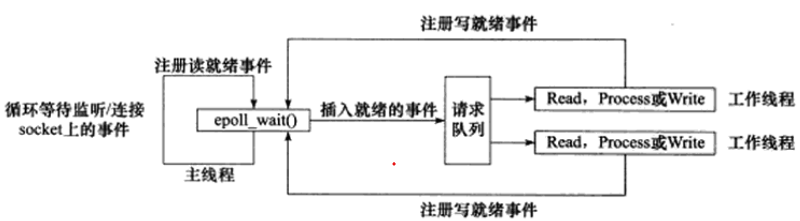

## 第八章 高性能服务器程序框架

- 服务器程序解构为三个模块：
  - I/O处理单元
  - 逻辑单元
  - 存储单元

### 服务器模型

#### C/S模型

- 所有客户端都通过访问服务器来获取资源。
- 服务器会创建一个或多个socket并监听。
- 客户端可以通过调用connect向服务器发起连接，由于连接请求是随机到达的异步事件，所以服务器需要使用某种I/O模型来监听这一事件。

#### P2P模型

- 点对点模型，每台机器都在消耗服务的同时给别人提供服务。

### 服务器编程框架

- `I/O处理单元`是服务器管理客户连接的模块。需要完成：等待并接受新的客户连接，接收客户数据，将服务器响应返回给客户端。
- `逻辑单元`是一个进程或线程。分析并处理用户数据，然后将结果传递给I/O处理单元或直接发送给客户端。
- `网络存储单元`可以是数据库，缓存或文件。
- `请求队列`是各单元之间的通信方式的抽象。I/O处理单元接收到客户请求时，需要以某种方式通知一个逻辑单元来处理该请求；多个逻辑单元访问同一个存储单元时，也需要某种机制来协调竞态条件。

### I/O模型

- 称阻塞的文件描述符为阻塞I/O， 非阻塞的文件描述符为非阻塞I/O。

- 针对`阻塞I/O`执行的系统调用可能因为无法立即完成而被操作系统挂起，直到等待的事件发生。socket的基础API中，可能被阻塞的系统调用包括accept，send，recv和connect。

- 针对`非阻塞I/O`执行的系统调用总是立即返回，不论事件是否已经发生。因此，非阻塞I/O通常和其他I/O通知机制一起使用，比如I/O复用和SIGIO信号。

- `I/O复用`：应用程序通过I/O复用向内核注册一组事件，内核通过I/O复用将其中就绪的事件通知给应用程序。常见的I/O复用函数有select，poll和epoll。

- 关于`同步`，`异步`，`阻塞`，`非阻塞`的例子：

  ```
  老张爱喝茶，废话不说，煮开水。 
  出场人物：老张，水壶两把（普通水壶，简称水壶；会响的水壶，简称响水壶）。
  1 老张把水壶放到火上，立等水开。（同步阻塞） 
  2 老张把水壶放到火上，去客厅看电视，时不时去厨房看看水开没有。（同步非阻塞）
  3 老张把响水壶放到火上，立等水开。（异步阻塞） 
  4 老张把响水壶放到火上，去客厅看电视，水壶响之前不再去看它了，响了再去拿壶。（异步非阻塞） 
  
  所谓同步异步，只是对于水壶而言。 普通水壶，同步；响水壶，异步。 虽然都能干活，但响水壶可以在自己完工之后，提示老张水开了。这是普通水壶所不能及的。 同步只能让调用者去轮询自己（情况2中），造成老张效率的低下。
  同步：内核向应用程序通知的是I/O就绪事件，并由应用程序完成完成I/O操作；
  异步：内核向应用程序通知的是I/O完成事件，I/O操作已经被完成。
  
  
  所谓阻塞非阻塞，仅仅对于老张而言。 立等的老张，阻塞；看电视的老张，非阻塞。 情况1和情况3中老张就是阻塞的，媳妇喊他都不知道。虽然3中响水壶是异步的，可对于立等的老张没有太大的意义。所以一般异步是配合非阻塞使用的，这样才能发挥异步的效用。
  ```

- 阻塞I/O，I/O复用，信号驱动I/O都是同步I/O模型。

| I/O模型   | 同步和阻塞                                                                                  |
| --------- | ------------------------------------------------------------------------------------------- |
| 阻塞I/O   | 等待数据时阻塞；数据从内核复制到用户空间时阻塞                                              |
| 非阻塞I/O | 等待数据不阻塞,但是轮询会占用cpu资源；数据从内核复制到用户空间时阻塞                        |
| I/O复用   | 考虑到轮询占用cpu资源的问题,阻塞在选择器上,减轻处理器负担；将数据从内核复制到用户空间时阻塞 |
| SIGIO信号 | 等待数据不阻塞；数据准备好时通知接收数据,将数据从内核复制到用户空间时阻塞                   |
| 异步I/O   | 等待数据时不阻塞；将数据从内核复制到用户空间时也不阻塞.                                     |

### 两种高效的事件处理模式

#### Reactor模式

- 主线程(I/O处理单元)只负责监听文件描述符上是否有事件发生，有就通知工作线程(逻辑单元)。
- 读写数据，接受新的连接，处理客户请求均在工作线程。
- 比如，同步I/O模型epoll_wait实现的Reactor模式的工作流程是：
  1. 主线程往epoll内核事件表中注册socket上的`读就绪`事件；
  2. 主线程调用epoll_wait等待socket上有数据可读；
  3. 当socket上有数据可读时，epoll_wait通知主线程，主线程则将socket可读事件放入请求队列；
  4. 睡眠在请求队列上的某个工作线程被唤醒，他从socket读取数据，并处理客户请求，然后往epoll内核时间表中注册该socket上的`写就绪`事件；
  5. 主线程调用epoll_wait等待socket可写；
  6. 当socket可写时，epoll_wait通知主线程，主线程将socket可写事件放入请求队列；
  7. 睡眠在请求队列上的某个工作线程被唤醒，他往socket写入服务器处理客户请求的结果。



#### Proactor模式

- 将所有I/O操作都交给主线程和内核处理，工作线程仅仅负责业务逻辑。
- 以异步I/O模型aio_read和aio_write为例：
  1. 主线程调用aio_read函数向内核注册socket上的`读完成`事件，并告诉内核用户读缓冲区的位置，以及读操作完成时该如何通知应用程序；
  2. 主线程继续处理其他逻辑；
  3. 当socket上的数据被读入用户缓冲区后，内核向应用程序发送信号通知应用程序数据可用；
  4. 应用程序预先定义好的信号处理函数选择一个工作线程来处理客户请求。工作线程处理完客户请求后，调用aio_write函数向内核注册socket上的`写完成`事件，并告诉内核用户写缓冲的位置，以及写操作完成后如何通知应用程序；
  5. 主线程继续处理其他逻辑；
  6. 当用户缓冲区数据被写入socket后，内核向应用程序发送信号通知应用程序数据已经发送完毕；
  7. 应用程序预先定义好的信号处理函数选择一个工作线程来做后续处理，比如决定是否关闭socket。


#### 模拟Proactor模式

- 可以使用同步I/O方式模拟出Proactor模式。
- 原理是：主线程执行数据读写操作，完成后主线程向工作线程通知这一”完成事件“，从工作线程的角度来看，它获得了数据读写完成的结果，还需要的做的就是对读写的结果进行逻辑处理。

- 同步I/O模拟Proactor模式流程：
  1. 主线程往epoll内核事件表中注册socket上的`读就绪`事件；
  2. 主线程调用epoll_wait等待socket上有数据可读；
  3. 当socket上有数据可读时，epoll_wait通知主线程，主线程从socket循环读取数据，直到没有数据可读，然后将读取的数据封装成一个请求对象并插入请求队列；
  4. 睡眠在请求队列上的某个工作线程被唤醒，他获得请求对象并处理客户请求，然后往epoll内核时间表中注册该socket上的`写就绪`事件；
  5. 主线程调用epoll_wait等待socket可写；
  6. 当socket可写时，epoll_wait通知主线程，主线程往socket上写入服务器处理客户请求的结果。


### 两种高效的并发模式

- 在某个线程由于I/O操作而阻塞时，切换到其他线程执行能显著提升cpu的利用率。

- 并发模式是指I/O处理单元和多个逻辑单元之间协调完成任务的方法。

#### 半同步/半异步模式

- 并发模式中的“同步”，“异步”的含义和I/O模型中的“同步”，“异步”不相同。

| 同步模式                       | 异步模式                                                       |
| ------------------------------ | -------------------------------------------------------------- |
| 程序完全按照代码序列的顺序执行 | 程序的执行需要由系统事件来驱动，常见的系统事件包括中断，信号等 |
| 逻辑简单，便于扩展             | 执行效率高，实时性强                                           |
| 执行效率相对较低，实时性较差   | 相对复杂，难于调式和扩展，不适合大量的并发                     |

- 半同步/半异步模式：同步线程用于处理用户逻辑，异步线程用于处理I/O事件

#### 领导者/追随者模式

- 多个工作线程轮流获得事件源集合，轮流监听，分发并处理事件。
- 任何时间点，都有且仅有一个领导者线程，它负责监听I/O事件，监听到后首先从线程池中推选出新的领导者线程，然后处理I/O事件。新的领导者继续监听I/O事件。
- 包含以下几个组件：
  - 句柄集(HandleSet)：句柄(Handle)用于表示I/O资源，Linux下通常为文件描述符。句柄集管理多个句柄，并且使用wait_for_event方法监听这些句柄上的I/O事件，将其中的就绪事件通知给领导者线程。领导者则调用绑定到Handle上的事件处理器来处理事件。
  - 线程集(ThreadSet)：所有工作线程(包括领导者线程和追随者线程)的管理者。负责各线程之间的同步，以及新领导者线程的推选。线程状态有：
    - Leader：领导者；
    - Processing：正在处理事件；
    - Follower：追随者。
  - 事件处理器(EventHandler)：通常包含一个或多个回调函数，用于处理事件对应的业务逻辑。事件处理器需要被绑定到某个句柄上，当该句柄有事件发生时，领导者就执行与之绑定的事件处理器中的回调函数。
  - 具体的事件处理器(ConcreteEventHandler)：

### 有限状态机

- 逻辑单元内的高效编程方法。

- 状态独立的有限状态机：

  ```c++
  STATE_MACHINE(Package _pack){
  	PackageType _type = _pack.GetType();
  	switch(_type){
  		case typeA:
  			process_package_A(_pack);
  			break;
  		case typeB:
  			process_package_B(_pack);
  			break;
  	}
  }
  ```

  - 这是一个简单的有限状态机，每个状态都是相互独立的，没有相互转移。

- 带状态转移的有限状态机：

  ```c++
  STATE_MACHINE(){
      State cur_State = type_A;
      while(cur_State != type_C){
          Package _pack = getNewPackage();
  		switch(cur_State){
  		case typeA:
  			process_package_A(_pack);
              cur_State = type_B;
  			break;
  		case typeB:
  			process_package_B(_pack);
              cur_State = type_C;
  			break;
  	}
  }
  ```

  - 这个状态机包含了三种状态：type_A，type_B，type_C，并且会进行转移。

- 有限状态机的实例：HTTP请求的读取和分析。

  - HTTP协议没有包含头部长度字段，头部结束的标志是遇到一个空行，该空行仅包含一对回车换行符(<CR><LF>)。
  - 所以需要在读的同时寻找空行，并且完成对HTTP请求头部的分析，以提高解析HTTP请求的效率。

### 提高服务器性能的其他建议

#### 池

- 池是一组资源的集合，这组资源来服务器启动之初就被完全创建并初始化，这称为静态资源分配。
- 常见的有内存池，进程池，线程池和连接池。
  - 内存池常用于socket的接收缓存和发送缓存。对于某些长度有限的请求是很合理的。
  - 进程池和线程池都是并发编程常用的方法。当需要一个工作进程或工作线程来处理新到来的客户请求时，可以直接从池中取而无需重新创建。
  - 连接池用于服务器或服务器机群的内部永久连接，它是服务器预先和数据库程序建立的一组连接的集合。比如逻辑单元访问数据库，不需要每次都建立连接，而是使用连接池。

#### 数据复制

- 避免不必要的复制，尤其复制发生在用户代码和内核之间的时候。如果内核可以直接处理从socket或文件读入的数据，则应用程序就没必要将这些数据从内核缓冲区复制到应用程序缓冲区中。
- 用户代码内部的数据复制也应该避免。

#### 上下文切换和锁

- 上下文切换是进程或线程切换时所耗费的系统开销，比如cpu寄存器，程序计数器的保存切换。
- 锁是对共享资源的保护访问。

